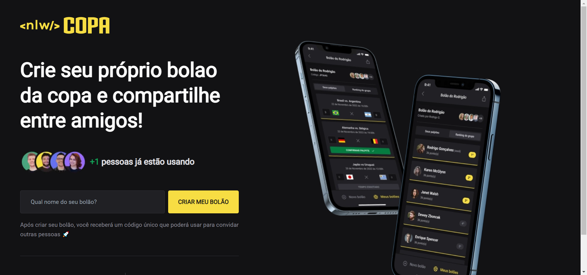
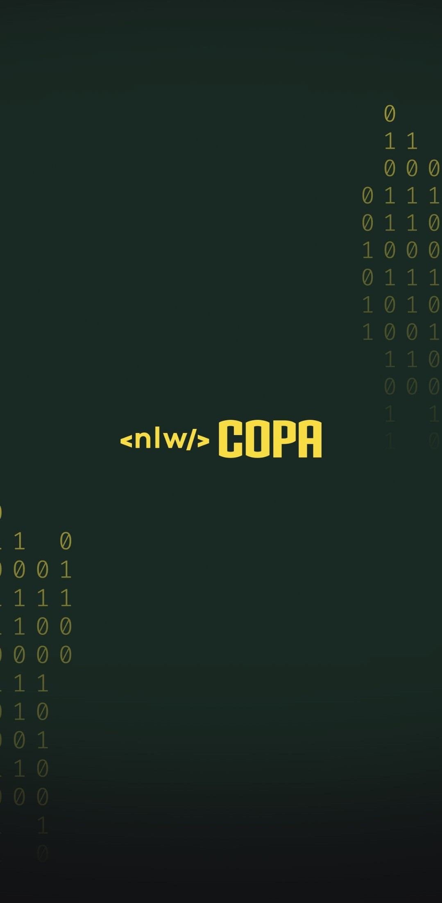
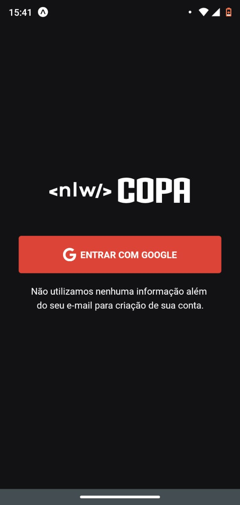
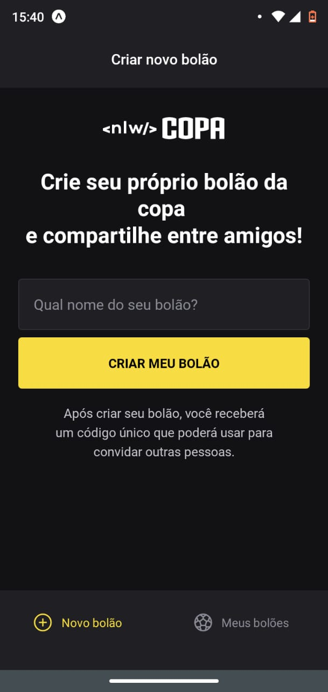
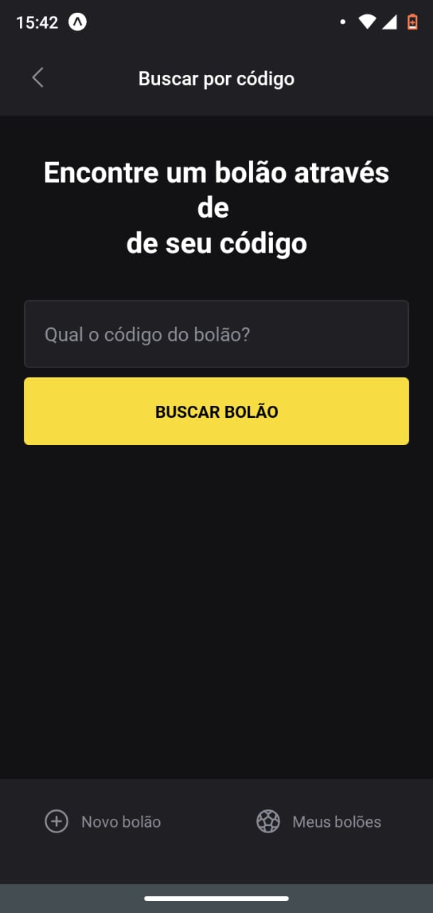
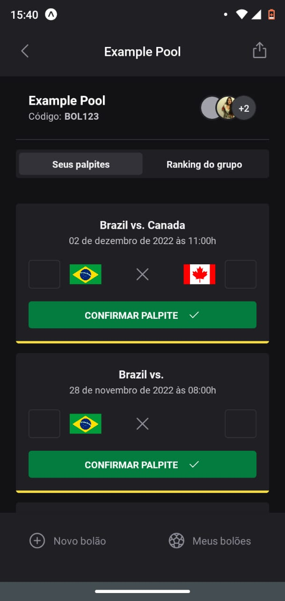
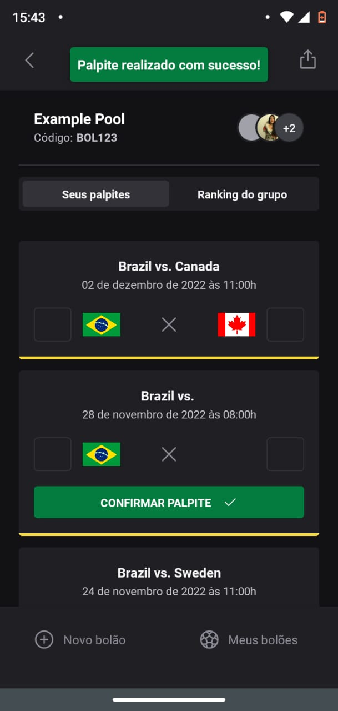

# **Bolão da Copa 2022**

  
  
  
  
  
  
  
  

> Trilha Ignite NLW Copa - [Rocketseat](https://lp.rocketseat.com.br/nlw).

Projeto construído durante o evento NLW Copa da Rocketseat na trilha Ignite.

**[🔗 Clique aqui para acessar](https://github.com/Bamarcheti/nlw-copa)**

## **🛠 Tecnologias**

> ### _Banco de Dados_
>
> 

> ### _Server_
>
>  >  >  >  > 

> ### _Frontend_
>
>  >  > 

> ### _Mobile_
>
>  > 

> ### _Bibliotecas e Ferramentas_
>
>  >  >  >  > 

> ### _Pacotes e extensões_

- Prisma-erd-generator
- Diagramas com base nas configurações do banco de dados
  Mermaid-cli
- Geração de diagramas através de códigos
  @fastify/cors
- Controle de acesso cross origin
  Zod
- Validação de Esquemas
  Short-unique-id
- Criação de UUID únicas
  PostCSS
- Codificação CSS com JavaScript
  Autoprefixer
- Plugin para transcrição do PostCSS

## **✨ Como executar**

- [Backend](./server/README.md)
- [Frontend](./web/README.md)
- [Mobile](./mobile/README.md)

## **💄 Layout**

Para você poder visualizar o layout do projeto é necessário acessar o link abaixo:

- [Layout](https://www.figma.com/community/file/1169028343875283461)

Lembrando que você precisa ter uma conta no [Figma](http://figma.com/).

## **💛 Contato**

